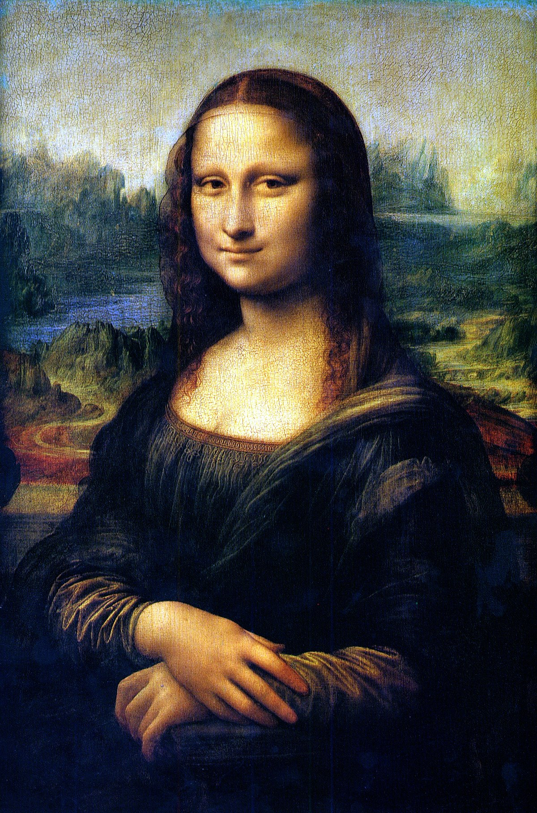

# fun-with-ascii-art
Convert images and videos to ascii art!

You can either print the result to terminal or to an html/video file.
<br />
<br />

## **How to Start**
---
### 1. Install Dependencies
Run the below code and poetry will install all the necessary dependencies.
```
poetry install
```
<br />

### 2. Add Files
Create a folder (ex. `img/`) at the root of this repository and add files you want to convert.
<br /> <br />

### 3. Run the Script
Run `my_ascii.py` file.
Here is an example of running the script file at the root of this repository.
```
poetry run python3 fun_with_ascii_art/my_ascii.py --file img/ --width 20 --style color
```

You need to pass 4 arguments below.
- file : Either put in a path to a folder that holds files, or a path to a img/video file you want to convert. This package supports `png`, `jpg`, `jpeg`, `mov`, `mp3` and `avi`.
- width : Desired width (int) of the ascii result. Height will automatically be set according to the original ratio of the img/video.
- style : Style of ascii you want to convert to. Options are `default`, `emoji`, `line`, `underscore`, `korean` and `terminal`. All except `terminal` will create an html file result if input is an image, and a video result if input is a video. Option `terminal` will print the result to the terminal directly.
- color (optional) : Color of the result. Options are `color`, `grayscale` and `bw`. This argument is optional. It's set as `grayscale` by default.

<br /> <br />
## **Result Examples**
---
Below are the results of converting *Mona Lisa* with different styles and colors. Width was set to 30.



|  | Color | Grayscale | BW |
| ----------- | ----------- | ----------- | ----------- |
| Default |  |  |  |
| Line |  |  |  |
| Underscore |  |  |  |
| Korean |  |  |  |
| Emoji |  |
| Terminal |  |


*You can change the font, line height and so many stuff of the result HTML file to make it more interesting!*